## Writeup
---

**Advanced Lane Finding Project**

The goals / steps of this project are the following:

* Compute the camera calibration matrix and distortion coefficients given a set of chessboard images.
* Apply a distortion correction to raw images.
* Use color transforms, gradients, etc., to create a thresholded binary image.
* Apply a perspective transform to rectify binary image ("birds-eye view").
* Detect lane pixels and fit to find the lane boundary.
* Determine the curvature of the lane and vehicle position with respect to center.
* Warp the detected lane boundaries back onto the original image.
* Output visual display of the lane boundaries and numerical estimation of lane curvature and vehicle position.

## [Rubric](https://review.udacity.com/#!/rubrics/571/view) Points

### Here I will consider the rubric points individually and describe how I addressed each point in my implementation.  

---

### Camera Calibration

#### 1. Briefly state how you computed the camera matrix and distortion coefficients. Provide an example of a distortion corrected calibration image.

The code for this step is contained in the 2nd code cell (In[2]:) of the IPython notebook, `P4.ipynb`.  

I start by preparing "object points", which will be the (x, y, z) coordinates of the chessboard corners in the world. Here I am assuming the chessboard is fixed on the (x, y) plane at z=0, such that the object points are the same for each calibration image.  Thus, `objp` is just a replicated array of coordinates, and `objpoints` will be appended with a copy of it every time I successfully detect all chessboard corners in a test image.  `imgpoints` will be appended with the (x, y) pixel position of each of the corners in the image plane with each successful chessboard detection.  

<div style="text-align:center"><br/>
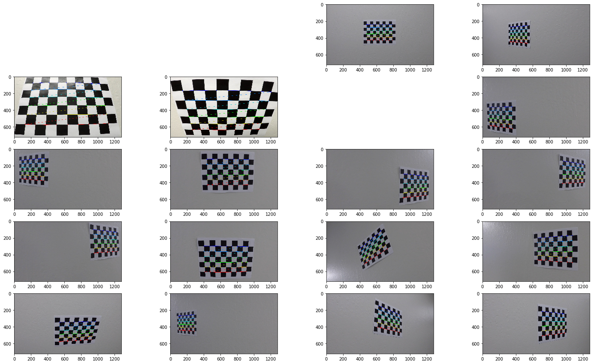<br/>
The detected chessboard corners<br/><br/>
</div>

I then used the output `objpoints` and `imgpoints` to compute the camera calibration and distortion coefficients using the `cv2.calibrateCamera()` function.  I applied this distortion correction to the test image using the `cv2.undistort()` function and obtained this result:

<div style="text-align:center"><br/>
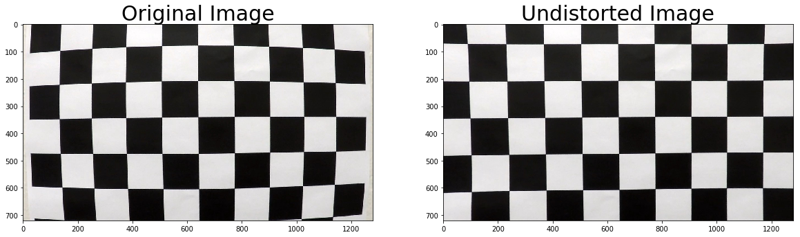<br/>
The undistorted chessboard image<br/><br/>
</div>

### Pipeline (single images)

#### 1. Provide an example of a distortion-corrected image.

To demonstrate this step, I will describe how I apply the distortion correction in the 4th code cell (In[4]:) of `P4.ipynb` to the test images like this one:

<div style="text-align:center"><br/>
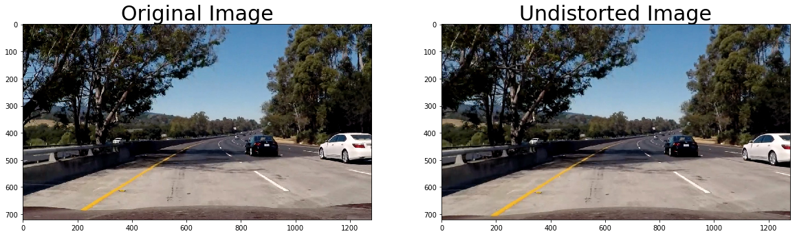<br/>
An original (left) and undistorted (right) image<br/><br/>
</div>

#### 2. Describe how (and identify where in your code) you used color transforms, gradients or other methods to create a thresholded binary image.  Provide an example of a binary image result.

I used a combination of X direction gradient and S color channel thresholds to generate a binary image using a function called `CombineBinary()` in the 5th code cell (In[5]:) of `P4.ipynb`. Here's an example of my output for this step:

<div style="text-align:center"><br/>
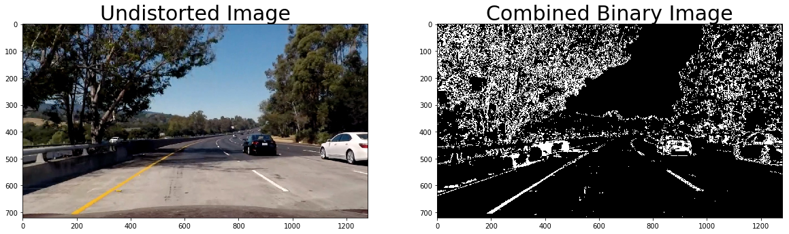<br/>
An undistorted (left) and combined binary (right) image<br/><br/>
</div>

#### 3. Describe how (and identify where in your code) you performed a perspective transform and provide an example of a transformed image.

I used the `cv2.warpPerspective()` for perspective transform in the 6th code cell (In[6]:) of `P4.ipynb`. Assuming the vanishing point of the picture is at (1280x0.5, 720x0.575) and the start points of both lane lines when the vehicle is center between the lane lines are at (200, 700) and (1080, 700), the source points `src` are choosen from vertices of a trapezoid made by the value of `ratio`, which is 0.625 in this project.

<div style="text-align:center"><br/>
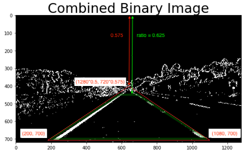<br/>
a trapezoid made by the value of `ratio`<br/><br/>
</div>

On the other hand, the destination points `dst` are hardcode.

```python
ratio = 0.625
offset = (img.shape[1]/2-200) / (img.shape[0]*(1-0.575)) * (img.shape[0]*(ratio-0.575))

src = np.float32([[img.shape[1]/2-offset,img.shape[0]*ratio], [img.shape[1]/2+offset,img.shape[0]*ratio],
                  [200,img.shape[0]-20], [img.shape[1]-200,img.shape[0]-20]])
dst = np.float32([[300,0], [img.shape[1]-300,0],
                  [300,img.shape[0]], [img.shape[1]-300,img.shape[0]]])

```

I verified that my perspective transform was working as expected by drawing the `src` and `dst` points onto a test image and its warped counterpart to verify that the lines appear parallel in the warped image.

<div style="text-align:center"><br/>
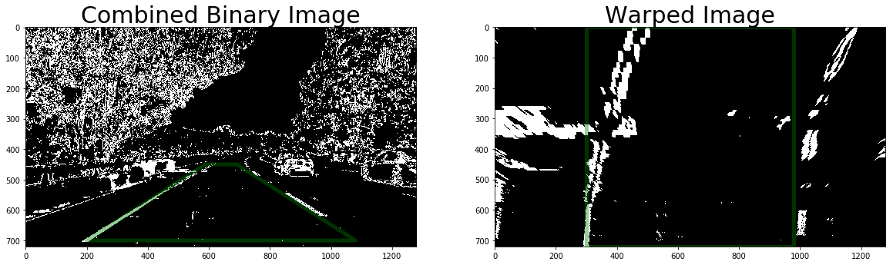<br/>
A combined binary (left) and warped (right) image<br/><br/>
</div>

#### 4. Describe how (and identify where in your code) you identified lane-line pixels and fit their positions with a polynomial?

First, sums up all values of pixels in the bottom quarter of the picture vertically, and smooths the result using `np.convolve()` with a `window` array that all the elements are 1 like `[1,1, ... ,1]` to find the start points of both left and right lane lines.

The two points which have the highest value in left half (0-639) and right (640-1279) after smoothing would be the start centroid points of left and right lane lines respectively. Howevert, I had to aware the offset of the detected points produced by `np.convolve()`, which is half length of the `window` array. These two detected lane line start points need to be subtracted by `len(window) / 2`.

<div style="text-align:center"><br/>
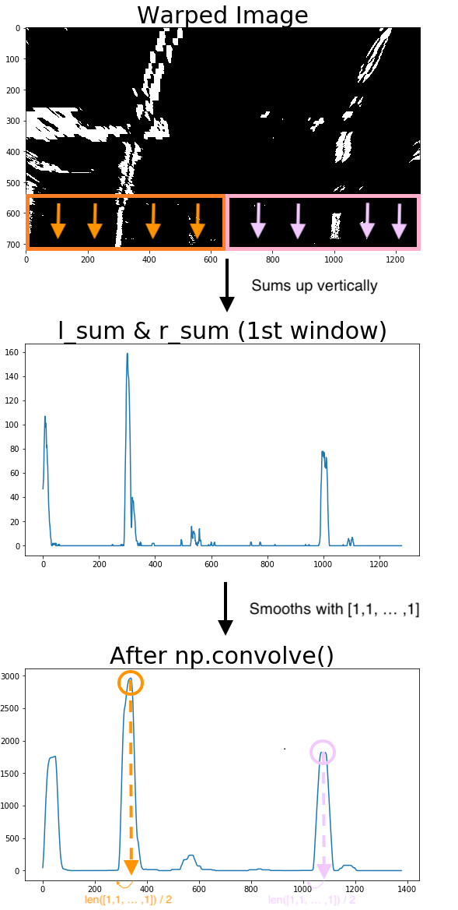<br/>
Sums up vertically and sooths the result<br/><br/>
</div>

After find the start points, do teh same thing repeatedly (8 times vertically) within the range +/- `margin`, which is 40 in this project, horizontally. Then masks around these centroid points (the total comes to 8x2 points because of left line plus right line) with a rectangular, and extract lane line pixels within the window rectangulars to aply polynomial fitting.

I did these processed using functions called `window_mask()`, `find_window_centroids()`, `Border()` in the 7th code cell (In[7]:) of `P4.ipynb`. The result is:

<div style="text-align:center"><br/>
<br/>
A combined binary (left) and warped (right) image<br/><br/>
</div>

If the detected lane line pixels are not enough, the centroid point will be previous one like this (the left lane line):

<div style="text-align:center"><br/>
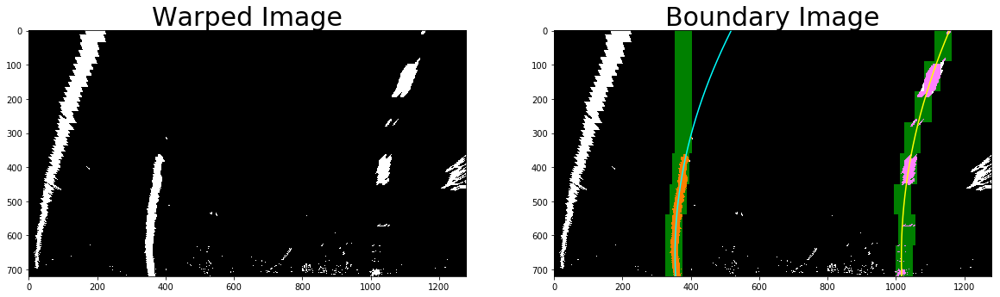<br/>
A combined binary (left) and warped (right) image<br/><br/>
</div>

Although, the polynomial fitting works well because the fitting is based on the extracted pixels (<font color="orange">orange</font> or <font color="pink">pink</font>) within the window rectangulars (<font color="green">green</font>), not centroid points itself.

#### 5. Describe how (and identify where in your code) you calculated the radius of curvature of the lane and the position of the vehicle with respect to center.

The left and right curvature are calculated in `Border()` function using `ym_per_pix` = 30/720 [m/pixel], and I took the average between left and right radius of curvature In the 8th code cell (In[8]:) of `P4.ipynb`.

```python
left_curverad = ((1 + (2*left_fit_cr[0]*(boundary.shape[0]*ym_per_pix) + left_fit_cr[1])**2)**1.5) \
                  / np.absolute(2*left_fit_cr[0]) #[m]
right_curverad = ((1 + (2*right_fit_cr[0]*(boundary.shape[0]*ym_per_pix) + right_fit_cr[1])**2)**1.5) \
                  / np.absolute(2*right_fit_cr[0]) #[m]

curverad_array = (left_curverad_array+right_curverad_array) / 2.0 #[m]

```

Also, I multiply the offset pixel between the center of both lane lines and the center of the picture by `xm_per_pix` = 3.7/700 [m/pixel] to calculate the vehicle position. A minus value means that the vehicle is on left from the center of the road, and a plus value means that the vehicle is on right.

```ptyhon
vehicle_position_array = -((window_centroids_array[:,1]-window_centroids_array[:,0])/2.0 \
                         + window_centroids_array[:,0] - img_size[0]/2.0) * xm_per_pix #[m]

```

#### 6. Provide an example image of your result plotted back down onto the road such that the lane area is identified clearly.

Finally, fills the space between two fitted lines, and un-warps (warps back) the image using `M_inv`, a matrix just source points `src` and destination points `dst` are opposite from warping matrix `M`.

<div style="text-align:center"><br/>
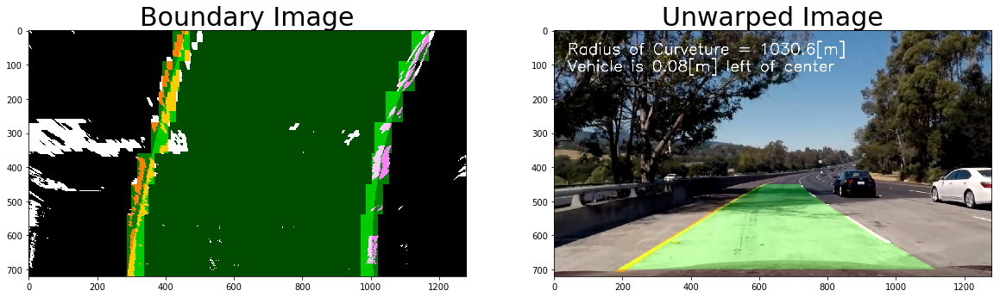<br/>
A combined binary (left) and warped (right) image<br/><br/>
</div>

These processes are in a function called `Unwarp()` in the 9th code cell (In[9]:) of `P4.ipynb`.

---

### Pipeline (video)

#### 1. Provide a link to your final video output.  Your pipeline should perform reasonably well on the entire project video (wobbly lines are ok but no catastrophic failures that would cause the car to drive off the road!).

Here's a [link to my video result (./output_videos/project_video_output.mp4)](./output_videos/project_video_output.mp4)

To apply my pipeline to a video, I created a class named `Line()` to track lane line information such as *detected successfully or not*, *the first centroid points*, *recent N frames and average fitted pixels*, *recent N frames and average fitted coefficients*, *curvature*, and *vehicle position* in the 11th code cell (In[75]:) of `P4.ipynb`.

Moreover, I overwrote some functions, `find_window_centroids()`, `Border()`, `Unwarp()`, in the 10th code cell (In[74]:) of `P4.ipynb` to take advantages from the `Line()` class object.

If the width between detected lane lines is within +/- 0.3[m] from 3.7[m] (which is standard width of lines) and the difference between current **2nd** order coefficient and past N frames (5 frames in this project) average is less than 0.001, the detected lines would be recognized as good one and its information would be stored into the class instance. If the detection fails, the function just uses previous information stored in the `Line()` class instance (which means don't store the current detected information into the class instance). This sanity checking is implemented in the `Border()` function.

```python
# If line_obj.avg_fit is not set yet,
if ((line_obj.avg_fit==0).all() == True):
    ''' STORE THE DETECTED INFORMATION INTO THE CLASS '''

# If line_obj.avg_fit is set already & the width between detected lines is 3.4[m] ~ 4.0[m],
elif (abs((right_fitx[img_size[1]-1]-left_fitx[img_size[1]-1])*xm_per_pix - 3.7) <= 0.3):
    line_obj.updateDetected(True)

    # If the difference of 2nd-order coefficient is enough small,
    if (abs(np.sum(line_obj.avg_fit[0]-current_fit[0])) <= 1.0e-3):
        ''' STORE THE DETECTED INFORMATION INTO THE CLASS '''

else:
    line_obj.updateDetected(False)

```

When the previous detection works well, the `find_window_centroids()` seeks the next lane line only around previous lane line.  If the detection fails N frames (5 frames in this project) in a row, the function seeks the lane lines from scratch.

```python
if ((len(line_obj.detected)==0) or (line_obj.detected.any()==False)):
    ''' SEEKS THE LANE LINES FROM SCRATCH '''

else:
    ''' SEEKS THE LANE LINES ONLY AROUND PREVIOUS ONE '''

```

---

### Discussion

#### 1. Briefly discuss any problems / issues you faced in your implementation of this project.  Where will your pipeline likely fail?  What could you do to make it more robust?

This program assumes there are no any cars in front of the own vehicle. If there is a car (or a motorbike), some portion of lane line will be hidden and it may cause detection problems.

<div style="text-align:center"><br/>
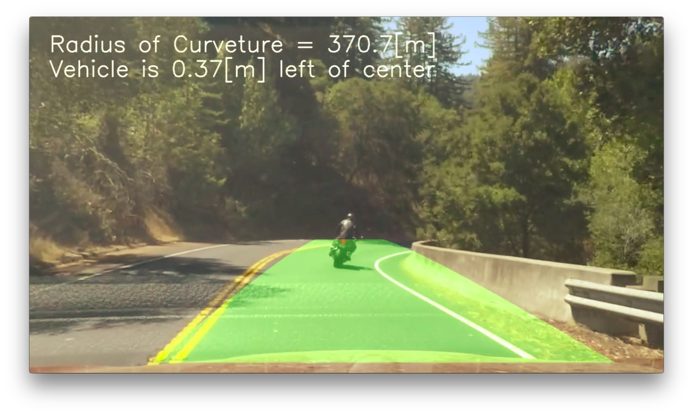<br/>
An one scene from `harder_challenge_video_output.mp4`<br/><br/>
</div>

One of the solutions of this would be implementing a function to detect the a car (using computer vision, machine learning, etc.) and subtract the position of the detected car from the interested area (masked area) for finding lane lines.

Other problem will cause when the curvature of the lane lines is too sharp. The interested area (masked area) for seeking lane lines in this project is fixed, not dynamic.

<div style="text-align:center"><br/>
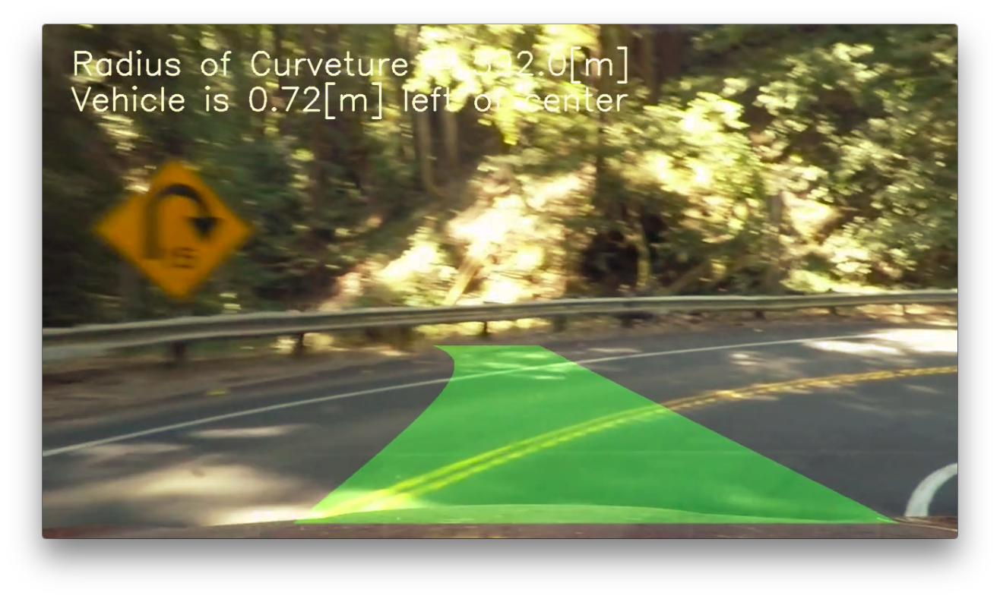<br/>
Another scene from `harder_challenge_video_output.mp4`<br/><br/>
</div>

To avoid this, the interested area (masked area) should be changed corresponding the circumstance around the own vehicle, or we can install additional cameras on both left and right side of the car because human drivers usually turn their head and look the turning direction. (Nobody can turn sharp curves perfectly fixing their head and only looking forward.)
